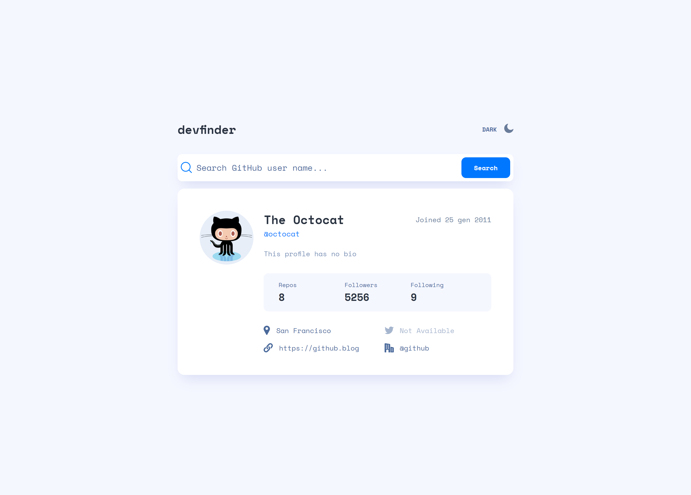

# Frontend Mentor - GitHub user search app solution

This is a solution to the [GitHub user search app challenge on Frontend Mentor](https://www.frontendmentor.io/challenges/github-user-search-app-Q09YOgaH6). Frontend Mentor challenges help you improve your coding skills by building realistic projects.

## Table of contents

-   [Overview](#overview)
    -   [The challenge](#the-challenge)
    -   [Screenshot](#screenshot)
    -   [Links](#links)
-   [My process](#my-process)
    -   [Built with](#built-with)
    -   [What I learned](#what-i-learned)
    -   [Continued development](#continued-development)
    -   [Useful resources](#useful-resources)
-   [Author](#author)
-   [Acknowledgments](#acknowledgments)

## Overview

### The challenge

Users should be able to:

-   View the optimal layout for the app depending on their device's screen size
-   See hover states for all interactive elements on the page
-   Search for GitHub users by their username
-   See relevant user information based on their search
-   Switch between light and dark themes
-   **Bonus**: Have the correct color scheme chosen for them based on their computer preferences. _Hint_: Research `prefers-color-scheme` in CSS.

### Screenshot

### Links

-   Solution URL: [Add solution URL here](https://github.com/Andro87/github-user-search-app-project.git)
-   Live Site URL: [Add live site URL here](https://github-user-search-app-project.vercel.app/)

## My process

### Built with

-   Semantic HTML5 markup
-   SCSS
-   Flexbox
-   CSS Grid
-   Mobile-first workflow
-   [React](https://reactjs.org/) - JS library
-   [Next.js](https://nextjs.org/) - React framework
-   [TypeScript](https://www.typescriptlang.org/)

### What I learned

While working through this project I had the possibility to improve my knowledge about how to interact with 3rd-party API.
I learnt how to create an interface that describes what is in the response, how to create a function to fetch the data from the API and how to handle errors.
The project also gave me the possibility to practise using react-hook-form.

### Continued development

I will improve my knowledge about Promises, how to handle Errors and practising with APIs.

### Useful resources

-   [How to Format Dates in JavaScript with One Line of Code](https://www.freecodecamp.org/news/how-to-format-dates-in-javascript/) - This helped me learn more about how to change date format in JS.
-   [React-hook-form](https://react-hook-form.com/get-started#Registerfields) - This is a fantastic library that allows me to build better forms .

## Author

-   Frontend Mentor - [@Andro87](https://www.frontendmentor.io/profile/Andro87)

## Acknowledgments

A big thanks to **wscandy** for his patience, explanations and guidance. He helped me a lot through this project and gave me the possibility to learn new concepts and ways to practise with APIs.
